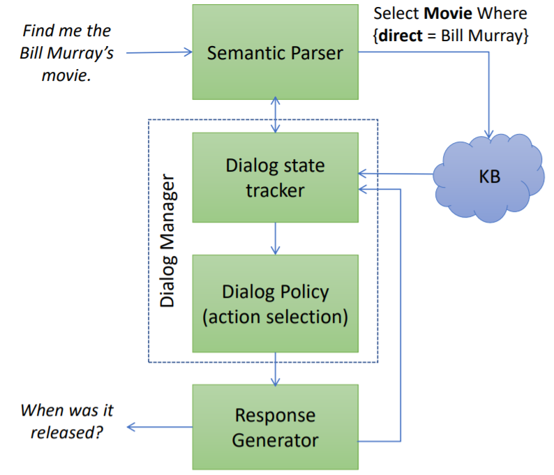
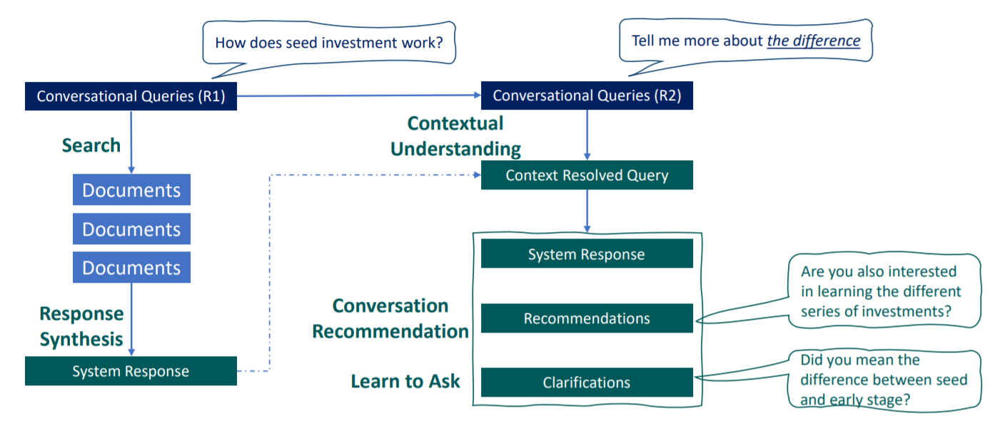
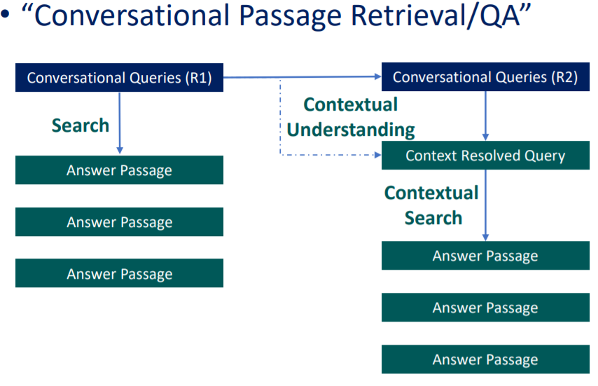
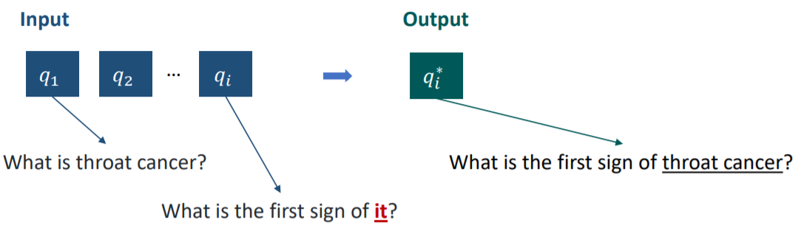
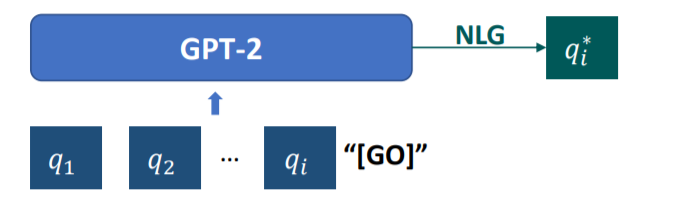
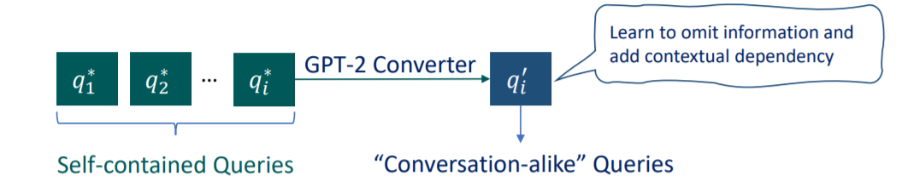
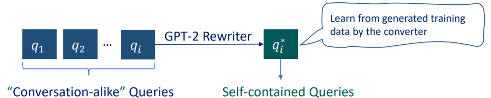
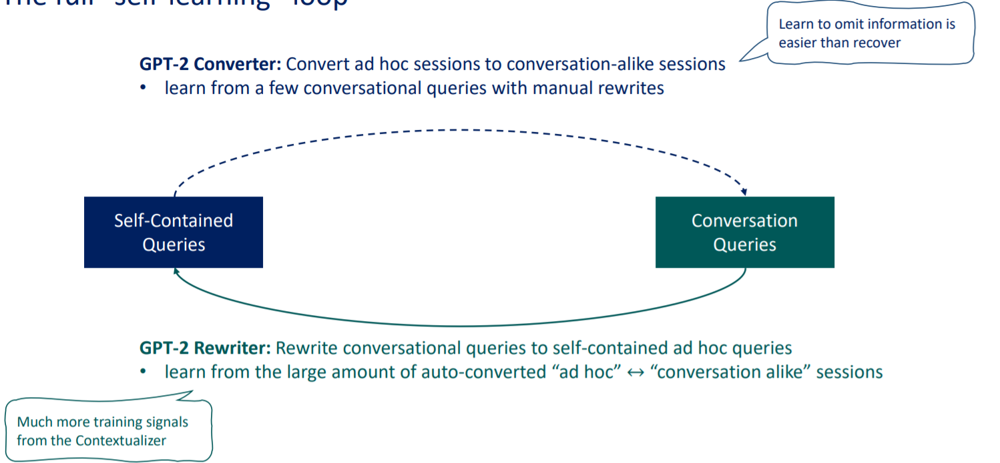

# Recent Advance in Conversational Information Retrieval

## What is Conversational Information Retrieval?

* A conversational Information Retrieval \(CIR\) system is
  * An informational retrieval system with
  * A conversational interface which
    * Allows users to interact with the system to seek information
    * Via multi-turn conversations of natural language.
* CIR is a task-oriented dialog system
* Complete tasks \(e.g. information seeking\) via multi-turn conversations of natural language.

## CIR research tasks \(task-oriented dialog modules\)

* Conversational Query Understanding \(LU, belief state tracking\)
* Conversational Document Ranking \(database state tracking\)
* Learning to Ask Clarification Questions \(action select via dialog policy, LG\)
* Conversational Leading Suggestions \(action select via dialog policy, LG\)
* Search Result Presentation \(Response Generation, LG\)

## Conversational Question Answering Methods

### C-KBOA \(Conversational Knowledge graph-based QA\) System Architecture

* Semantic Parser
  * Map input + context to a semantic representation \(logic form\) to
  * Query the KB
* Dialog Manager
  * Maintain/update state of dialog history \(e.g., QA pairs, DB state\)
  * Select next system action \(e.g., ask clarification question, answer\)
* Response Generator
  * Convert system action to natural language response
* KB search

### Dynamic Neural Semantic Parser \(DynSP\)

#### Problem description:

* Given a question \(dialog history\) and a table
* Generate a semantic parse \(SQL-query\)

#### Model Formulation:

* Parsing as a state-action search problem
  * A state S is a complete or partial parse \(action sequence\).
  * An action A is an operation to extend a parse
  * Parsing searches an end state with the highest score.
* Bean search to find the highest-scored parse \(end state\)
* Policy function, ,
  * Scores an action given the current state
  * Parameterized using different neural networks, each for an action type

#### Model Learning

* State value function:
  * * An E2E trainable, question-specific, neural network model
* Weakly supervised learning setting
  * * Question-answer pairs are available
    * Correct parse for each question is not available
* Issue of delayed \(sparse\) reward
* Approximate \(dense\) reward

#### Parameter Updates

* Make the sate value function behave similarly to reward R.
* For every state S and its \(approximated\) reference sate , define loss as
* Improve learning efficiency by finding the most violated state .

#### Extra semantic parser methods

* Building semantic parsers is challenging
  * Limited amounts of training data, or
  * Weak supervision
* C\_KBQA with no logic-form
  * Symbolic approach: “look before you hop.”
    * Answer an initial question using any standard KBQA.
    * Form a context subgraph using entities of the initial QA pair
    * Answer follow-up questions by expanding the context subgraph to find candidate answers.
  * Neural approach
    * Encode KB as graphs using GNN
    * Select answers from the encoded graph using a point network

### Query Rewriting Approaches to SQA

### Dialog Manager – Policy for next action selection

#### What clarification question to ask

* Baseline: ask all questions in a randomly sampled order
* Ask questions that users can answer
  * Learned from query logs
* Ask questions that help reduce search space
  * Entropy minimization
* Ask questions that help complete the task successfully
  * Reinforcement learning via agent-user interactions

### Response Generation

* Convert “dialog act” to “natural language response”
* Formulated as a seq2seq task in a few-shot learning setting
* Approach
  * Semantically conditioned neural language model
  * Pre-training + fine-tuning
    * e.g., semantically conditioned GPT \(SC-GPT\)

### Conversational QA over Texts

#### Dialog behaviors in Conversational QA

* Topic shift: a question about something previous discussed
* Drill down: a request for more information about a topic being discussed
* Topic return: asking about a topic again after being shifted.
* Clarification: reformulating a question
* Definition: asking what is meant by a term.

#### C-textQA system architecture

* Conversational MRC
  * Find answer to a question given text and previous QA pairs
  * Extractive \(span\) vs. abstractive answers
* Dialog manager  Maintain/update state of dialog history. \(e.g., QA pairs\)
  * Select next system action \(e.g., ask clarification questions, answer\)
* Response generator
  * Convert system action to natural language response.

#### Neural Conversational MRC models for extractive TextQA

* QA as classification given \(question, text\)
  * Classify each word in passage as start/end/outside of the answer span.
* Encoding: represent each passage word using an integrated context vector that encodes info from
  * Lexicon/word embedding \(context-free\) e.g., GloVe
    * Represent each word as a low-dim continuous vector.
  * Passage contextual embedding e.g., Bi-LSTM/RNN, ELMo, self-attention/BERT
    * Capture context info for each word within a passage.
  * Question contextual embedding e.g., Attention, BERT
    * Fuse question info into each passage word vector.
  * Conversational context embedding \(previous question-answer pairs\)
    * Pre-pending conversation history to current question or passage
    * BiDAF++ \(BiDAF for C-QA\)
      * Append a feature vector encoding dialog turn number to question embedding
      * Append a feature vector encoding N answer locations to passage embedding
    * BERT \(or RoBERTa\)
      * Prepending dialog history to current question
      * Using BERT as
        * Context embedding \(self-attention\)
        * Question/conversation context embedding \(inter-attention\)

#### System implementing issues

* Generalization: perform well on unseen data.
  * Pre-training
* Robustness: withstand adversarial attacks
  * Adversarial training
* To achieve both:
  * Past work finds that adversarial training can enhance robustness but hurts generalization
  * Apply adversarial pre-training\(ALUM\) improves both

## Conversational Search methods

### Why conversational search?

* Necessity:
  * Speech/mobile interfaces
* Opportunities:
  * More natural and explicit expression of information needs
  * Direct & Easier access to information
  * Serving complex information needs and tasks
  * Collaborative information seeking & better task assistance
* Challenge:
  * Query understanding & sparse retrieval
  * Document understanding; combine and synthesize information
  * Contextual understanding & memorization
  * Dialog management, less lenient user experience

### A view of Current Conversational Search

### A simple view from TREC CAsT 2019

#### Input:

* Manually written conversational queries
* ~20 topics, ~8 turns per topic
* Contextually dependent on previous queries

#### Corpus:

* MS MARCO + CAR Passages

#### Task:

* Passage Retrieval for conversational queries

#### Challenge:

* Contextual dependency on previous conversation queries

### Notable solutions in TREC CAsT 2019

#### Conversational query understanding via rewriting

* Learn to rewrite a full-grown context-resolved query

* Leverage pre-trained NLG model \(GPT-2\)

* Concern: Limited training data
  * 100X Millions of Parameters vs. 500 Manual Rewrite Labels of CAsT Y1 data

#### Few-Shot Conversational Query Rewriting

* Train conversational query rewriter with the help of ad hoc search data
* Leveraging ad hoc search sessions for conversational query understanding
  * Challenges:
    * Available only in commercial search engines
    * Approximate sessions available in MS MARCO
  * Keyword-ese
    * Filter by question words
  * No explicit context dependency
* Learn to convert ad hoc sessions to conversational query rounds
  * Contextualizer: make ad hoc sessions more conversation-alike

* * Training:
    * X \(self-contained q\): Manual rewrites of CAsT Y1 converational sessions
    * Y \(conversation-alike q\): Raw queries in CAsT Y1 sessions
  * Inference:
    * X \(self-contained q\): Ad hoc questions from MS MARCO sessions
    * Y \(conversation-alike q\): Auto-converted conversational sessions
  * Model:
    * Any pre-trained NLG model: GPT-2 Small in this Case
* Leverage the auto-converted conversation-ad hoc session pairs
  * Rewriter: recover the full self-contained queries from conversation rounds
  * 
  * Training:
    * X \(conversational-alike q\): Auto-converted from the Contextualizer
    * Y \(Self-contained q\): Raw queries from ad hoc MARCO sessions
  * Inference:
    * X \(Conversational-alike q\): CAsT Y1 raw conversational queries
    * Y \(Self-contained q\): auto-rewritten queries that are more self-contained
  * Model:
    * Any pre-trained NLG model: GPT-2 Small in this Case
* The Full “self-learning” loop

### More active assistant to make search engines more conversational

#### Conversation Recommendation

**“People Also Ask“：**

* Promoting more conversational experiences in search engines
* Challenge:
  * Relevant != Conversation Leading/Task assistance
  * User less lenient to active recommendation

**Beyond Relevance:**

* Recommending useful conversations that:
  * Help user complete their information needs
  * Assist user with their task
  * Provide meaningful explorations

**Conversation recommendation model: Multi-task BERT**

BERT seq2seq in the standard multi-task setting

**Implementing issues**

* Session trajectory:
  * Problem: the previous 3 signals were prone to leaning click-bait
    * We need more info about how user seek new information
  * Solution: imitate how users issue queries in sessions
  * Method:
    * Multi-task learning with inductive weak supervision

## Overview of public and commercial systems

### Research platforms and toolkits for building conversational experiences

#### Several Widely used Tooklits

**Research**

* [Microsoft Research ConvLab](https://convlab.github.io/)
  * Research platform for comparing models in a more research-oriented environment.
* [Macaw](https://github.com/microsoft/macaw)
  * Research platform for comparing models in a more research-oriented environment.

**Development**

* Google’s [Dialogflow](https://cloud.google.com/dialogflow)
  * Conversational experiences integrated with different engagement platforms with integration with Google’s Cloud Natural Language services
* Facebook’s [wit.ai](https://wit.ai/)
  * Supports intent understanding and connection to external REST APIs
* [Alexa Developer Tools](https://developer.amazon.com/en-US/alexa/)
  * Develop new skills for Alexa, devices with Alexa integrated for control, and enterprise-related interactions
* [Rasa](https://rasa.com/)
  * Provides an open source platform for text and voice-based assistants
* [Microsoft Power Virtual Agents on Azure](https://azure.microsoft.com/en-us/services/developer-tools/power-virtual-agents/)
  * Integrates technology from the Conversation Learner to build on top of LUIS and the Azure Bot service and learn from example dialogs.

